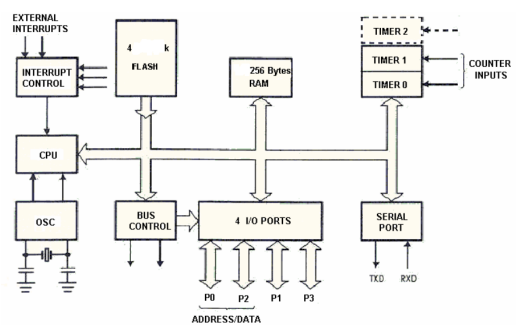
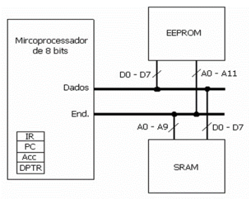

## Entrega 1 e 2

## Entrega 1: Questões

### Questão 1:
Apresentar a definição formal de um sistema embarcado, indicando a referência primária do IEEE (Institute of Electrical and Electronics Engineers) que subsidie esta definição. Em seguida fazer uma explanação breve e objetiva sobre as principais características, funcionalidades e o que difere um sistema embarcado de um computador de propósito geral.

> Resposta: De acordo com [ISO/IEC/IEEE 24765](https://ieeexplore.ieee.org/stamp/stamp.jsp?tp=&arnumber=8016712), "um sistema embarcado é um sistema computacional que é parte de um sistema maior e performa alguns dos requerimentos desse sistema". Os sistemas embarcados são comumente baseados em microcontroladores ou microprocesadores, que são dispositivos compactos que possibilitam os sistemas a serem também de tamanho reduzido. Além disso, os sistemas embarcados executam o processamento localmente, não dependendo de servidores remotos, e utilizam softwares que são projetados para uma tarefa específica. As principais diferenças entre esse tipo de sistema e um computador de propósito geral são: os sistemas embarcados são otimizados para tarefas específicas, enquanto os computadores são normalmente utilizados para uma gama de tarefas; os embarcados não precisam lidar com tantas tarefas simultâneas quanto um computador, o que possibilita seus componentes a serem mais baratos e compactos.   

### Questão 2: 
De acordo com os Relatórios de Pesquisa sobre o Mercado de Sistemas Embarcados acima referidos (listar os itens abaixo com base nos 2 relatórios disponibilizados):

- I: Das ferramentas para sistemas embarcados – quais as principais áreas de aplicação dos projetos no mercado brasileiro e o cenário internacional?

> Resposta: Internet das Coisas (IoT), Automação e Controle Industrial, Agroindústria e sistema para o campo etc..

- II: Quais as principais ferramentas de comunicação sem fio que estão sendo usadas no Brasil e no mundo?

> Resposta: Wifi, Celular (3G/4G), Bluetooth LE/Smart etc..

- III: Quais os principais kits/plataformas de prototipagem usados?

> Resposta: Kits com Esp32 e Kits de Desenvolvimento/Avaliação profissionais fornecidos pelo fabricante do processador ou módulo. 

- IV: Dos softwares para sistemas embarcados - qual a principal ferramenta de codificação, principal sistema de controle de versão, e principal linguagem de programação?

> Resposta: Visual Studio Code, GitHub e C/C++.

- V: Dos microprocessadores/microcontroladores – quais os fabricantes/modelos mais citados na pesquisa?

> Resposta: A Esp32 e STM32 são bastante utilizados, sendo fabricados pelas empresas Expressif e STMicroelectron. 

### Questão 3: 
Recorra ao exemplo do microcontrolador aplicado ao controle de um elevador que foi apresentado em aula, disponível nas transparências do Cap. 2. Quais as vantagens de se utilizar um microcontrolador para aquele tipo de aplicação e qual deve ser o “perfil” de um microcontrolador ideal para aquela aplicação do elevador em termos de capacidade da CPU (baixa, média ou alta), quantidade de bits no barramento, e precisão no tratamento das informações (operação somente com inteiros ou ponto flutuante?)

> Resposta: 

### Questão 4: 
Quanto às portas paralelas de um microcontrolador:

( ) São somente de entrada. <br/> 
( ) São somente de saída.  <br/> 
() Cada palavra (A, B, C, P1, P2, P3…) pode ser configurada como entrada ou saída. <br/> 
( ) Cada bit pode ser configurado como entrada ou saída. <br/> 
(x) Cada palavra (A, B, C... P1, P2, P3…) pode ser configurada como entrada, saída ou bidirecional. <br/> 
(x) Cada bit pode ser configurado como entrada, saída ou bidirecional. <br/> 

### Questão 5: 
Assinale V para verdadeiro e F para falso nas afirmações abaixo.

(V) No modelo de Von Neumann, o microprocessador segue as instruções armazenadas na
memória ROM (programas), lê as entradas e envia comandos sobre os canais de saída,
alterando as informações contidas na memória RAM. <br/> 
(V) Os registradores Special Function Registers localizam-se sempre internos à CPU. <br/> 
(F) O ciclo de máquina é composto pelo ciclo de busca mais o ciclo de execução, cada qual
demorando um pulso de clock. <br/> 
(F) A instrução “CLR A” não possui operando e gasta apenas 1 ciclo de máquina. <br/> 
(V) A arquitetura Von Neumann é considerada uma arquitetura mais simples do que a arquitetura
Harvard porque utiliza o mesmo barramento para o tráfego de dados e de instruções. <br/> 
(F) A técnica de pipeline é impossível de ser utilizada em computadores de arquitetura Von
Neumann. <br/> 

### Questão 6: 
Indique quais afirmativas se aplicam a uma instrução CISC e quais a uma instrução RISC.

➔ No sentido de códigos mais difíceis de ler é o RISC, no caso de complexidade computacional é o CISC - Os programas são mais complexos <br/> 
➔ RISC - A maioria das instruções tem a mesma duração. <br/> 
➔ CISC - Mais instruções disponíveis. <br/> 
➔ CISC - Programas menores. <br/> 
➔ RISC - Utiliza menos espaço na memória de programa. <br/> 
➔ CISC - Processamento de cada instrução é mais lento. <br/> 
➔ RISC - Microcontroladores PIC, AVR, ARM. <br/> 
➔ CISC - Tempo de execução das instruções depende da frequência do clock. <br/> 

### Questão 7: 
Abaixo é apresentado o diagrama de um microcontrolador. Qual a arquitetura utilizada e como chegamos a essa conclusão? Quantas portas I/O bidirecional e quantas linhas (bits/pinos) são endereçados de forma individual neste microcontrolador, com base no diagrama abaixo?



> Resposta: O diagrama é do 8051, cujo possui arquitetura Harvard e CISC, isso é evidenciado na separação entre a memória de dados e memória de programa. Continuando, possui 4 pinos I/O biredicionais (P0, P1, P2, P3) de 8 bits, totalizando 32 linhas de entrada/saída. 

### Questão 8:
No simulador EdSim51, digite e execute (clicando em “Assm”) as instruções abaixo.

```
MOV R0, #22h
MOV 00h, #22h
```

Qual a diferença entre as duas instruções acima? Tente refletir porque possuem ciclos de
máquina diferentes se a operação é realizada na mesma posição de memória RAM (00h ou
R0 usa o mesmo espaço).

> Resposta: As duas instruções movem diretamente o valor 22h para a mesma posição de memótia RAM, porém, a diferença é que, enquanto a primeira move para para o registrador R0, a segunda move para o endereço 00h. A instrução que move diretamente para o registrador R0 roda em apenas 1 ciclo de máquina, e isso se dá pois registradores fazem parte da CPU e, portanto, podem ser acessados mais rapidamente

```
MOV A, #22h
MOV ACC, #22h
```

Qual a diferença entre as duas instruções acima? Tente refletir sobre a diferença de usar A ou
ACC e sobre porque possuem ciclos de máquina diferentes se a operação realizada é a
mesma.

> Resposta: A primeira instrução gasta 1us, já a segunda, 2us. Isso se dá pois o acumulador A é conectado à ALU e outras unidades funcionais e, assim, acessá-lo envolve caminhos mais curtos e menos multiplexadores. Já mover para ACC envolve o acesso de memótia, o que gasta mais ciclos de máquina. 

### Questão 9: 
A Figura abaixo mostra um microcontrolador genérico de 8 bits com 4 registradores internos à CPU, os quais são: Instruction Register (IR), Program Counter (PC), Accumulator (ACC) e Data Pointer (DPTR). Baseado na Figura abaixo, responda às questões com verdadeiro (V) ou Falso (F). 



(V) Trata-se de um microcontrolador de arquitetura Harvard. <br/> 
(V) A memória EEPROM é de 4Kbytes e armazena as instruções que comandam o
microcontrolador. <br/> 
(F) A memória SRAM é de 512 bytes e armazena dados voláteis. <br/> 
(F ) O registrador IR tem a função de armazenar a instrução lida da memória SRAM. <br/> 
(V) Para esse microcontrolador, o registrador IR deve ser de 8 bits. <br/> 
(V) O registrador PC armazena o endereço da instrução lida da memória EEPROM. <br/> 
(F) Para esse microcontrolador, o registrador PC deve ser de 10 bits. <br/> 
(T) Para esse microcontrolador, o registrador ACC deve ser de 8 bits. <br/> 
(F) O registrador DPTR é um ponteiro que aponta para a última instrução lida da memória. <br/> 
(T) Para esse microcontrolador, o registrador DPTR deve ser de 10 bits. <br/> 

### Questão 10: 
Responder com Verdadeiro (V) ou Falso (F) às seguintes afirmações.

(F) A pilha é uma memória RAM sequencial do tipo FIFO. <br/> 
(V) A pilha geralmente é utilizada para armazenar endereço de retorno de subrotinas e também
de interrupções. <br/> 
(F) O ponteiro de pilha (Stack Pointer) é um registrador que aponta para um endereço da
memória ROM, que é o endereço de retorno do programa após o atendimento a uma interrupção
ou sub-rotina. <br/> 
(V) As instruções PUSH e POP são exclusivas para operações com pilha. <br/> 
(V) A instrução CALL <endereço> deve ser usada para indicar qual endereço o programa deve
desviar no caso de um atendimento à interrupção ou chamada de sub-rotina. <br/> 
(V) A instrução RET, colocada no final de uma sub-rotina, faz com que o último endereço
armazenado na pilha seja carregado no registrador PC (program counter). <br/> 
(V) A área da RAM interna dedicada à pilha é determinada pelo ponteiro SP, um dos SFRs, que
possui tamanho 8 bits, mesmo tamanho do barramento de endereço da CPU. <br/> 
(Essa afirmação se refere ao que? Flip-flops tipo D são muito utilizados em diversas área como elementos de memória como RAM, fila, contadores, etc.) Geralmente são baseadas em flip-flops tipo D. <br/> 

### Questão 11: 
Refletir se existe diferença entre o endereço armazenado em um espaço de pilha e o endereço
armazenado no Stack Pointer (SP)?

> Resposta: Sim, há diferença. O endereço armazenado em um espaço da pilha representa um local da memória que contém algum dado. Enquanto o endereço armazenado no stack pointer é o último endereço no qual foi adicionado um dado na pilha, ou seja, o stack pointer aponta para o topo da pilha.

### Questão 12: 
Colocou-se 3 LEDs nos endereços P1.0, P1.1 e P1.2 no microcontrolador e 3 chaves nos
endereços P2.0, P2.1 e P2.2. Considerando que os LEDs acendem quando é colocado nível
baixo na saída e as chaves, quando pressionadas, colocam nível baixo na porta, explique o
funcionamento do programa abaixo quando cada uma destas 3 chaves são pressionadas.

```
ORG 0000H
Leitura:
    JNB P2.0, PX
    JNB P2.1, PY
    JNB P2.2, PZ
    LCALL Leitura

PX:
    MOV P1, #0
    RET
PY:
    MOV P1, #00000101b
    RET
PZ:
    MOV A, P1
    CPL A
    MOV P1, A
    RET
FIM:
    SJMP FIM
```

> Resposta: O código funciona da seguinte forma: quando pressionada a chave P2.0, apagasse todos os LED. Já quando pressiona-se a chave P2.1, os LEDs P1.0 e P1.2 acendem e o P1.1 apaga. E, no caso da chave P2.2, esta inverte o estado de todos os LEDs, ou seja, o que estiver apagado se acende e vice-versa.
>>>>>>> entrega_1

## Entrega 2: 

Atividade prática de uso de set de instruções e manipulação de dados em registradores e endereços de memória em microcontroladores

- Apresentar diretamente no documento (mesmo documento da Entrega 1) as linhas de código (programa devidamente comentado e, quando for caso, as respostas às perguntas específicas ao final do programa).
- As respostas devem seguir a ordem do roteiro. Por exemplo:

### 1 - Manipulação de dados em registradores e endereços de memória por meio de instruções de transferência de dados:

```
ORG 0000h       ; Define o endereço de origem

main:                  ; Label para o início do programa
        MOV A, #0FFh   ; Move o valor hexadecimal FF para o registrador acumulador (A) (1µs)
        MOV A, #0      ; Move o valor zero para o registrador acumulador (A) (1µs)
        MOV R1, #0A5h  ; Move o valor hexadecimal A5 para o registrador R1 no banco 00 (1µs)
        MOV B, #0F0h   ; Move o valor hexadecimal F0 para o registrador B (2µs)
        MOV A, P1      ; Move o conteúdo da porta P1 para o registrador acumulador (A) (1µs)
        MOV 7Fh, A     ; Move o conteúdo do registrador A para o endereço de memória 7Fh (1µs)
        MOV R2, 7Fh    ; Move o conteúdo da posição de memória 7Fh para o registrador R2 no banco 01 (2µs)
        MOV 40h, R2    ; Move o conteúdo do registrador R2 para o endereço de memória 40h (2µs)
        MOV R1, #40h   ; Aponta o endereço de memória 40h como valor para R1 (1µs)
        MOV A, @R1     ; Move o conteúdo do endereço de memória apontado por R1 para o acumulador (A) (1µs)
        MOV DPH, #9Ah  ; Move o byte mais significativo do valor 9A5B para DPH (2µs)
        MOV DPL, #5Bh  ; Move o byte menos significativo do valor 9A5B para DPL (2µs)
        NOP            ; Gera um atraso de 1µs (1µs)
        END            ; Indica o fim do programa
```
a) O tempo total gasto pelo programa foi de 18µs. <br/> 
b) O programa teve 15 ciclos de máquina, 1 para cada instrução, com exceção do END que usou 2 ciclos. <br/> 
c) Quando se moveu uma porta inteira para P1 apareceu o valor FF, e isso ocorreu por conta dos pinos da porta estarem flutuando, e o microprocessador acaba os definindo como 1 (alto). <br/> 
d) O valor que apareceu no acumulador continua sendo FFh, pois, é o maior valor possível em hexadecimal, então, mesmo quando foi adicionado o valor de 40h, o acumulador mantém o seu valor máximo. <br/> 
e) Só foi possível mover um valor de 4 dígitos para DPTR pois o mesmo foi dividido em dois comandos de 2 dígitos para DPH e DPL. O maior valor possível que pode ser movido para DPTR é FFFFh, caso seja dividido em 2 comandos como citado acima. <br/> 

### 2 - Manipulação de dados em registradores e endereços de memória por meio de instruções Aritméticas:

```
ORG 00h           ; Define o endereço de origem

main:             ; Label de início
    MOV A, #2     ; Move o valor imediato 2 para o acumulador (A)
    MOV B, #3     ; Move o valor imediato 3 para o registrador B
    MOV 30h, #7   ; Move o valor imediato 7 para o endereço de memória 30h
    ADD A, 30h    ; Soma o conteúdo do endereço de memória 30h ao acumulador (A)
    SUBB A, #3    ; Decrementa o valor do acumulador (A) em 3 unidades
    INC B         ; Incrementa o valor do registrador B em 1 
    SUBB A, B     ; Subtrai o valor do registrador B do valor do acumulador (A)
    MUL AB        ; Multiplica A por B
    INC B         ; Incrementa o valor do registrador B em 1 
    INC B         ; Incrementa o valor do registrador B em 1  mais uma vez
    DIV AB        ; Divide A por B
    MOV 20h, A    ; Armazena o conteúdo do registrador A no endereço de memória 20h
    MOV 21h, B    ; Armazena o conteúdo do registrador B no endereço de memória 21h
END              ; Encerra o programa
```
a) Os respectivos valores de 3 e 4 em binário são 011 e 100, logo, o bit mais significativo do 3 é 0 e do 4 é 1, por isso o valo.  <br/>
b) A operação resulta em FFh, pois não tem como representar números negativos em hexadecimal, logo, ele trata como se fosse um “ciclo”, tendo o valor 00h como início e FFh como fim, logo se você voltar um passo do início, chega ao fim. <br/>

### 3 - Manipulação de dados em registradores e endereços de memória por meio de instruções lógicas e booleanas: 

```
ORG 00h      ; Endereço de origem do programa
main:        ; Label main
    MOV A, #00101101b   ; Move o valor imediato 00101101b para o acumulador (A)
    MOV B, #11011010b   ; Move o valor imediato 11011010b para o registrador B
    ANL A, B             ; Realiza a operação lógica AND entre A e B
    RRC A                ; Rotaciona o conteúdo de A para a direita
    CPL A                ; Realiza o complemento de A
    RLC A                ; Rotaciona o conteúdo de A para a esquerda
    ORL A, B             ; Realiza a operação lógica OR entre A e B
    XRL A, B             ; Realiza a operação lógica XOR entre A e B
    SWAP A               ; Realiza a operação de SWAP em A

    SJMP main            ; Salta de volta para a label inicial "main"

END                     ; Finaliza o programa
```

### 4- Manipulação de dados em registradores e endereços de memória por meio de instruções de desvio incondicional e condicional:

```
```

### 5 – Verificar sequencialmente o conteúdo das posições de memória de 20h até 23h e incrementar um registrador com a quantidade de valores menores do que #45h contidos nestas posições de memória:

```
```