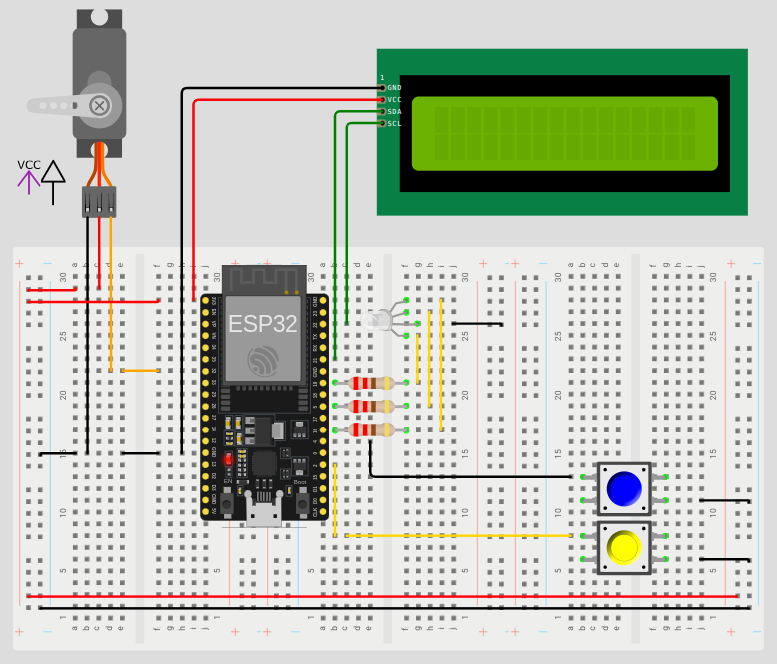
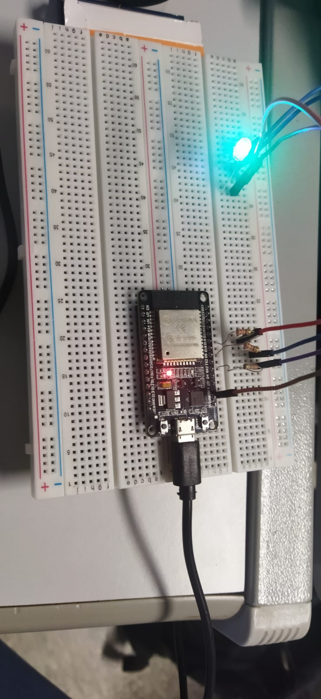

# Entrega Final

## Programa 1:

- **Descrição:** Criar um projeto no Wokwi utilizando o template da ESP32 e conectar um servo motor a um pino da GPIO (PWM) e a alimentação (GND e 3V3) da placa. Conectar também à placa um Display OLED, atentando-se para a ligação correta dos pinos SDA e SCL disponíveis para I2C na ESP32. 

- **O que é pedido:**
    1. Escrever um programa para controle PWM do servo motor, começando em 0° e movendo-se continuamente em intervalos (delays) de 100 ms até 180°. Quando o servo  motor chegar em 180°, aguardar um delay de 1 segundo e mover continuamente para Microcontroladores de 32 bits e ESP32DevKit 0° (sentido aposto) em intervalos de 200 ms. Quando chegar novamente em 0°, repetir todo o processo desde o início (loop).
    2. O processo da linha anterior (modo automático em loop) deve somente acontecer após um botão ser pressionado (botão loop);
    3. Um segundo botão deve parar o servo e desligar o sistema.
    4. Utilize a técnica PWM com a biblioteca “ESP32Servo”, considerando que a especificação de controle do servo motor escolhido é um sinal modulado com frequência de 50Hz, com referências de posicionamento inicial e final entre 500 e 2500 microsegundos.
    5. O ângulo do servo e o sentido da rotação deverão ser exibidos em um display OLED ou LCD I2C (usar as bibliotecas específicas para controle do display conforme exemplos) conectado à ESP32 via I2C e no monitor serial/terminal (UART) com 115.200 de baud rate. Utilizar a biblioteca “wire” para comunicação serial.
    6. Caso deseje implementar outras funcionalidades e recursos, sinta-se à vontade como, por exemplo, o uso de interrupção de GPIO para os botões; integração com os outros recursos (sensores e atuadores disponíveis no Wokwi). Tais implementações terão caráter complementar e de aprimoramento para a estrutura mínima solicitada acima. 
    7. Para a parte referente ao controle PWM, poderá ser aceito algum projeto alternativo ao solicitado acima, desde que envolva controle PWM de atuadores (preferencialmente de servo motor ou motor de passo) e seja compatível ou esteja em sintonia ao que foi solicitado (por exemplo, um projeto integrador desenvolvido em outra disciplina que tenha envolvido esses conceitos ou alguma aplicação prática de controle de movimento/posição em mecanismos, atuadores, motores ou robótica). Os resultados também devem ser exibidos em um display OLED ou LCD I2C bem como no monitor serial/terminal via comunicação serial. Caso escolha essa opção, justificar no documento de entrega a aplicação escolhida e como os conceitos de controle PWM estão envolvidos

### Resolução: 

- **Circuito:**  Foi desenvolvido com o auxilio do simulador online wookie. 
<div align="center">
  
</div>

- **Código:** Para acessar o código, basta ir a pasta **src** dento da pasta Projeto 2 - Servo, dentro dela encontra-se o [main.cpp](/Entrega%20Final/Projeto%202%20-%20LED%20RGB/src/main.cpp). 
- Entrentanto, caso deseje a versão **.ino**, ela se encontra dentro da pasta **Arduino**, segue o arquivo [Projeto_2_LED_RGB.ino](/Entrega%20Final/Arduino/Projeto_1_SERVO.ino).

```cpp
#include <ESP32Servo.h>
#include <LiquidCrystal_I2C.h>

LiquidCrystal_I2C lcd(0x27,16,2); //criando projeto cahmado lcd como seu tamanho

// Servo
#define SPWM 32
Servo servo;

// Buttons
#define ButtonStart 4
#define ButtonStop 2

// Variables
int currentAngle = 0;            // To track the current angle of the servo
bool startPressed = false;       // Flag to track if the start button has been pressed
bool stopPressed = false;        // Flag to track if the stop button has been pressed
const int buttonDelay = 50;      // Delay to debounce the button (in milliseconds)
const int servoDelayUp = 100;    // Delay between angle increments when moving up (in milliseconds)
const int servoDelayDown = 200;  // Delay between angle increments when moving down (in milliseconds)
const int servoWaitTime = 1000;  // Wait time at 180 degrees (in milliseconds)

void IRAM_ATTR startButtonPressed() {
  startPressed = true;
  stopPressed = false;
}

void IRAM_ATTR stopButtonPressed() {
  stopPressed = true;
  startPressed = false;
}

void setup() {
  Serial.begin(115200);
  lcd.init();
  lcd.backlight();

  // Set button pins as input with pull-up resistors
  pinMode(ButtonStart, INPUT_PULLUP);
  pinMode(ButtonStop, INPUT_PULLUP);

  // Attach interrupts to the button pins
  attachInterrupt(digitalPinToInterrupt(ButtonStart), startButtonPressed, FALLING);
  attachInterrupt(digitalPinToInterrupt(ButtonStop), stopButtonPressed, FALLING);

  // Attach the servo to the pin with min and max pulse width
  servo.attach(SPWM, 500, 2500);
  servo.write(currentAngle);  // Set initial position to 0 degrees

  lcd.setCursor(2,0);
  lcd.print("Projeto Servo e Esp32");
  lcd.setCursor(0,1);
  lcd.print("Microcontroladores");
  delay(4000); 
  lcd.clear(); 
}

void loop() {
  // Control servo movement based on the flags set by the buttons
  if (startPressed && !stopPressed) {
    moveServo();
  }

  // If stop button is pressed, stop the servo
  if (stopPressed) {
    servo.detach(); // Detach the servo to stop it
    stopPressed = false; // Reset the stop flag
    lcd.setCursor(2,0);
    lcd.print("Sistema Parado");
    lcd.setCursor(0,1);
    lcd.print("Microcontroladores");
    delay(4000); 
    lcd.clear();
  }
  
}

void moveServo() {
  // Move the servo from 0° to 180°
  for (currentAngle = 0; currentAngle <= 180; currentAngle++) {
    if (stopPressed) return;  // Exit if stop button is pressed
    servo.write(currentAngle);
    delay(servoDelayUp);
    lcd.setCursor(2,0);
    lcd.print("Direita");
    lcd.setCursor(0,1);
    lcd.print("Microcontroladores");
  }

  lcd.clear();

  delay(servoWaitTime); // Wait for 1 second at 180°

  // Move the servo from 180° back to 0°
  for (currentAngle = 180; currentAngle >= 0; currentAngle--) {
    if (stopPressed) return;  // Exit if stop button is pressed
    servo.write(currentAngle);
    delay(servoDelayDown);
    lcd.setCursor(2,0);
    lcd.print("Esquerda");
    lcd.setCursor(0,1);
    lcd.print("Microcontroladores");
    // 
  }

  lcd.clear();
}

```

- **Vídeo:**

https://github.com/thallys-smo/Microcontroladores/assets/72418094/e37a9293-51b7-4a91-9a99-07e60af21e43

## Programa 2: 

- **Descrição:** Conectar um LED RGB (catodo comum) na GPIO placa conforme esquemático ilustrado na Figura abaixo, utilizando resistores de 220 ohms, jumpers e protoboard. Tentar utilizar o App Dabble para comunicação Bluetooth com a ESP32 (ou algum, outro App alternativo de comunicação Bluetooth)

- **O que é pedido:** 
    1. Com base na documentação e exemplos disponibilizados na página da biblioteca “LEDC PWM Arduino-ESP32” neste link: https://espressif-docs.readthedocshosted.com/projects/arduino-esp32/en/latest/api/ledc.html. Elaborar um programa para realizar a modulação de cores em um LED RGB utilizando a técnica PWM.
    2. O PWM deverá controlar o brilho individual de cada cor “ R- Red”, “G- Green” e “B - Blue” do LED, com resolução de 8 bits (256 níveis); isto é, cada pino GPIO associado aos terminais R, G e B deve ser vinculado à um canal PWM individual da ESP32.
    3. Utilizar a biblioteca Led Control PWM da ESP32: “ledc” 
    4. O duty cycle deve variar de 0 a 100% em loop, com frequência de 5kHz, com valor de incremento pré-definido (por exemplo: se definir o valor “5”, o controle/resolução do brilho será feito de 5 em 5, até 255).
    5. O valor de incremento será aplicado de forma individual a cada cor do LED RGB da seguinte forma: R = incremento*2; G = incremento; B = incremento*3;
    6. Exibir uma mensagem no Monitor Serial/terminal (UART – baud: 115.200) que indique o valor de incremento e duty cycle.
    7. Comunicação sem fio: </br>
        7.1. Tentar instalar o App Dabble no seu smartphone. No PC, manipular diretamente o exemplo “02 Terminal”, disponibilizado pela biblioteca Dabble 
        Microcontroladores de 32 bits e ESP32DevKit (acessar na Arduino IDE em: Arquivos> Exemplos > DabbleESP32 > “02 - Terminal” - ou na pasta de exemplos disponibilizada no e-Disciplina, que contém este exemplo com explicações adicionais), adicionando uma variável que recebe o valor digitado no terminal do app Dabble para ser tratada como incremento no programa. Incorporar essa estrutura no programa principal que realiza o controle PWM do LED RGB de forma que o incremento do duty cycle </br>
        seja feito por meio desta variável. </br>
        7.2. Dessa forma, após gravar o programa na placa, abrir o app Dabble por meio do exemplo “Terminal”, conectar-se a ESP32 e digitar o valor do incremento desejado para o duty cycle (ou seja, se digitar 5, o controle do brilho será feito de 5 em 5 até 255). </br>
        7.3. É importante lembrar que o valor digitado no terminal do App Dabble deve ser reconhecido como string e posteriormente deve ser convertido para “inteiro” para ser tratado como valor de incremento pelo programa na Arduino IDE.</br>
        7.4. Essa parte poderá ser opcional caso a integração com o app Dabble não funcione por algum fator externo.</br>

### Resolução: 

- **Circuto:**

<div align="center">
        
      </div>

Em sala de aula, elaboramos o seguinte código [main.cpp](/Entrega%20Final/Projeto%202%20-%20LED%20RGB/src/main.cpp), ele foi desenvolvido dentro do ambiente do PlatformIO, o projeto encotra-se na pasta abaixo.

- [Projeto 2](/Entrega%20Final/Entrega%20Final/). Para acessar o código, basta ir a pasta **src**, dentro dela encontra-se o [main.cpp](/Entrega%20Final/Projeto%202%20-%20LED%20RGB/src/main.cpp). 
- Entrentanto, caso deseje a versão **.ino**, ela se encontra dentro da pasta **Arduino**, segue o arquivo [Projeto_2_LED_RGB.ino](/Entrega%20Final/Arduino/Projeto_2_LED_RGB.ino).

```cpp
#include <Arduino.h>

#define R 19
#define G 5
#define B 16

int DutyCycle_R = 0;
int DutyCycle_G = 0;
int DutyCycle_B = 0;
int increment = 1; // Declaration of the increment variable

void setup() {
  Serial.begin(115200); // Configures serial communication with a data transmission rate of 115200 bits per second.
  
  // Initialize the PWM outputs for LED control
  pinMode(R, OUTPUT);
  pinMode(G, OUTPUT);
  pinMode(B, OUTPUT);
}

void loop() {
  // Update duty cycle for LED colors
  analogWrite(R, DutyCycle_R);
  analogWrite(G, DutyCycle_G);
  analogWrite(B, DutyCycle_B);
  
  // Increase the duty cycle of each channel
  DutyCycle_R += 2 * increment;
  if (DutyCycle_R > 255) {
    DutyCycle_R = 0;
  }
  
  DutyCycle_G += increment;
  if (DutyCycle_G > 255) {
    DutyCycle_G = 0;
  }
  
  DutyCycle_B += 3 * increment;
  if (DutyCycle_B > 255) {
    DutyCycle_B = 0;
  }
  
  // Print increment and duty cycle values to Serial Monitor
  Serial.print("Increment: ");
  Serial.print(increment);
  Serial.print(", DutyCycle_R: ");
  Serial.print(DutyCycle_R);
  Serial.print(", DutyCycle_G: ");
  Serial.print(DutyCycle_G);
  Serial.print(", DutyCycle_B: ");
  Serial.println(DutyCycle_B);
  
  // Wait a short interval before updating the duty cycle again
  delay(100);
}

```

